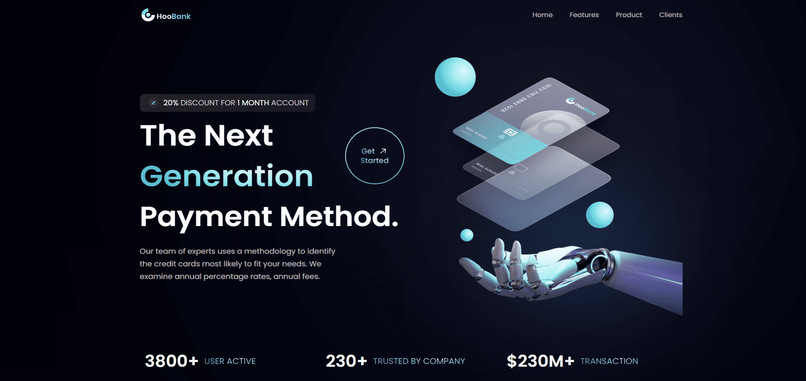

HooBank Modern UI/UX Application
================================  

[Live Website](https://utkarsh-hoobank.netlify.app/)  

The HooBank Modern UI/UX Application is a testament to the fusion of aesthetics and functionality, crafted with React.js and Tailwind CSS. It promises a seamless user experience across various devices and screen sizes.

## Key Features:  

* *Stunning Hero Section*: The application welcomes users with an eye-catching hero section, setting the tone for an engaging experience.  

* *High-Quality Assets and Gradients*: High-quality visuals and gradients enhance the overall design, providing a visually pleasing and modern look.  

* *Business Stats*: Informative business stats offer valuable insights, helping users make informed decisions.  

* *Reusable Feature Sections*: The app incorporates reusable feature sections with clear call-to-action buttons, making it user-friendly and intuitive.  

* *Testimonials*: Trust-building testimonials create a sense of reliability and credibility.  

HooBank's Modern UI/UX Application is not just visually appealing; it's a functional tool that seamlessly blends form and function to deliver a top-notch user experience. Whether you're showcasing business statistics or engaging with user testimonials, every element is thoughtfully designed to provide value and aesthetic appeal.  

